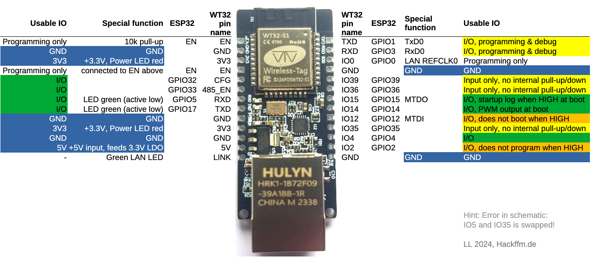
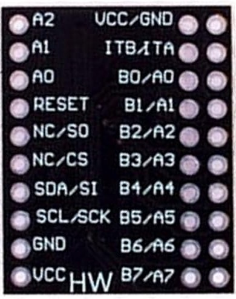
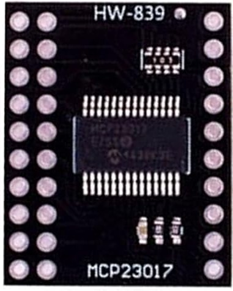
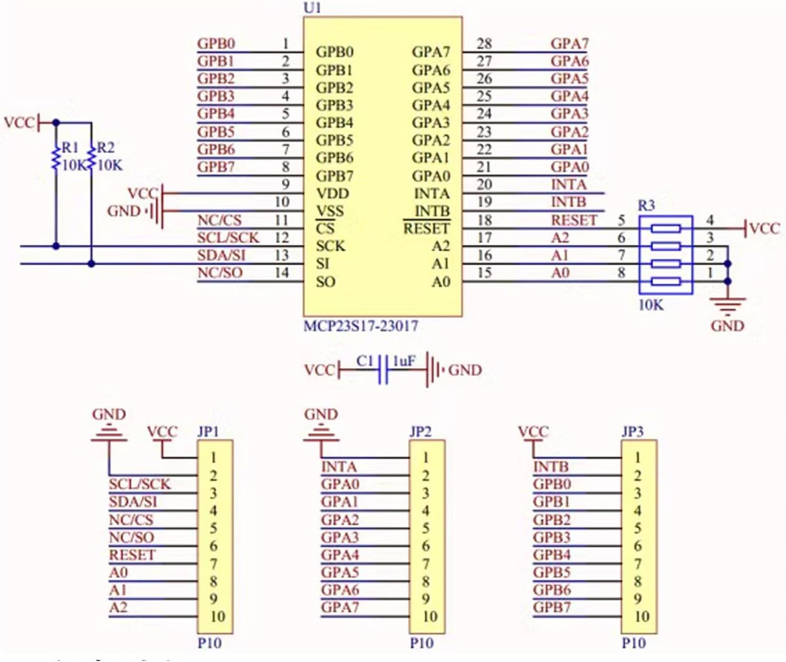

# WT32_KG - Smart Home Controller

## 📋 Beschreibung
Ein intelligentes Hausautomatisierungssystem basierend auf dem **WT32-ETH01 (ESP32)** Mikrocontroller. Das System steuert verschiedene Haushaltsgeräte wie Lampen, Rollos und andere elektrische Verbraucher über I²C-Relaismodule und kapazitive Touch-Sensoren.

## ⚙️ Hardware

### 🖥️ Hauptcontroller: WT32-ETH01 (ESP32) – Version 1.4


**Features:**
- Ethernet-Verbindung über LAN8720 PHY
- I²C Kommunikation (GPIO32/SCL, GPIO33/SDA)
- Integrierte WiFi-Funktionalität
- 240MHz Dual-Core Prozessor

**PINMAP WT32-ETH01**

```
                        ┌──────────────────────────┐
                        │      ╔═══════════╗       │
                        │      ║   ESP32   ║       │
                        │      ║   WROOM   ║       │
                        │      ║     S1    ║       │
                        │      ╚═══════════╝       │
                        ├──────────────────────────┤
                        │                          │
    EN (Programming)  1 │●                        ●│ 24  TXD (GPIO1)   - I/O, Prog & Debug
    GND (Masse)       2 │●                        ●│ 23  RXD (GPIO3)   - I/O, Prog & Debug  
    3V3 (+3.3V)       3 │●                        ●│ 22  IO0 (GPIO0)   - LAN REFCLK0
    EN (Programming)  4 │●                        ●│ 21  GND (Masse)
    CFG (GPIO32)      5 │●                        ●│ 20  IO39 (GPIO39) - MCP23017 IRQ (Input-only)
    485_EN (GPIO33)   6 │●                        ●│ 19  IO36 (GPIO36) - MPR121 IRQ (Input-only)
    ---             7 │●                        ●│ 18  IO14 (GPIO14) - LED Dimmer PWM
    TXD (GPIO17)      8 │●                        ●│ 17  IO15 (GPIO15) - Reserve
    RXD (GPIO05)      9 │●                        ●│ 16  IO04 (GPIO04) - AC Dimmer PWM
    3V3 (+3.3V)      10 │●                        ●│ 15  IO35 (GPIO35) - 1-Wire DS18B20 (Input-only)
    GND (Masse)      11 │●                        ●│ 14  IO12 (GPIO12) - ⚠️ BOOT fail wenn HIGH!
    5V (+5V In)      12 │●                        ●│ 13  IO2  (GPIO2)  - NO PROG if HIGH
                        │                          │
                        ├───┐                  ┌───┤
                        │   │   ╔══════════╗   │   │
                        │   │   ║   RJ45   ║   │   │
                        │   │   ║ Ethernet ║   │   │
                        │   │   ╚══════════╝   │   │
                        └───┘                  └───┘
```

**📍 24-Pin Header Belegung (physikalische Pins):**

Siehe ASCII-Diagramm oben für die physikalische Pin-Zuordnung.  
Für die komplette GPIO-Funktionszuordnung siehe die GPIO-Übersichtstabelle weiter unten.

> **⚠️ HINWEIS:** Laut Diagramm sind **IO5 und IO35** im offiziellen Schaltplan **vertauscht**!  
> Die korrekte Zuordnung ist in der GPIO-Übersichtstabelle unten aufgeführt.

### 🔌 Relais Boards: XL9535-K1V5
8 Kanal Erweiterungsrelais Modul 5V Netzteil I²C Kommunikation Optokoppler Isolation Board

here is a very good documentations about this type of boards:
https://github.com/mcauser/micropython-xl9535-kxv5-relay


#### Verkabelung: 3x PCA9535 Relais Boards (Daisy Chain)

**I²C-Adressen:**
- Board A: `0x22` (A1 gelötet, A0+A2 offen)
- Board B: `0x23` (A1+A0 gelötet, A2 offen)  
- Board C: `0x24` (A2 gelötet, A0+A1 offen)

### 📥 Input Expander: MCP23017 (1x 16-Bit GPIO)
16-Bit I/O Expander für digitale Eingänge (Schalter, Taster, Kreuzschaltungen) und Reserve-Ausgänge





#### MCP23017 Pin-Belegung

**I²C-Adresse:** `0x20` (Standard - A2, A1, A0 alle auf GND)

**Port A (GPA0-GPA7) - Schalter/Taster:**
- `GPA0`: IR-Switch Küche EG11 - Linker Taster (Input mit Pull-Up)
- `GPA1`: IR-Switch Küche EG11 - Rechter Taster (Input mit Pull-Up)
- `GPA2`: Kreuzschaltung EG1 - Taster Treppe OG (Input mit Pull-Up)
- `GPA3`: Kreuzschaltung EG2 - Taster Eingang EG (Input mit Pull-Up)
- `GPA4`: Kreuzschaltung KG1 - Taster Tür Schlafzimmer (Input mit Pull-Up)
- `GPA5`: Kreuzschaltung KG2 - Taster Bad KG (Input mit Pull-Up)
- `GPA6`: Kreuzschaltung KG3 - Taster Treppe KG-EG (Input mit Pull-Up)
- `GPA7`: Reserve (früher MPR121 IRQ, jetzt auf GPIO36)

**Port B (GPB0-GPB7) - Reserve:**
- `GPB0-GPB7`: Reserve für zukünftige Eingänge/Ausgänge

**MCP23017 Interrupt:**
- `INTA/INTB`: Verbunden mit **GPIO39** (ESP32) - triggert bei Änderung auf GPA0-7 oder GPB0-7

⚠️ **WICHTIG - Level Shifter erforderlich für MPR121 Touchboards!**
Die 3 MPR121 Touchboards arbeiten mit **5V I²C und 5V IRQ Logik**, der ESP32 mit **3.3V Logik**.
- **Alle 3 MPR121 IRQ-Leitungen werden mit Wired-OR kombiniert** → **GPIO36** (ESP32) über Level Shifter
- **Ein bidirektionaler Level Shifter ist ZWINGEND erforderlich** (z.B. TXB0108, PCA9306) für:
  - **SCL**: 3.3V → 5V (Output WT32 → Input Touchboards)
  - **SDA**: bidirektional 3.3V ↔ 5V
  - **IRQ (Wired-OR)**: 5V → 3.3V (Output Touchboards → Input GPIO36 ESP32)
- **OHNE Level Shifter**: 5V-Signale beschädigen die 3.3V-Eingänge des ESP32!

**Spezifikationen:**
- 16 digitale Ein-/Ausgänge mit individueller Konfiguration
- I²C Interface (GPIO32/SCL, GPIO33/SDA)
- 3.3V Logik-Versorgung über I²C Bus
- Interner Pull-Up für Input-Pins verfügbar
- Interrupt-Fähig für Edge-Detection

---

### 🌡️ AC Dimmer: YYAC-3S (1x 220V PWM AC-Dimmer)
PWM-Dimmer für 220V AC-Lasten (Kronleuchter, Halogen, LED-Trafos mit Phasenanschnitt)


#### AC Dimmer GPIO-Belegung

**GPIO-Zuordnung:**
- `GPIO4`: PWM-Signal (0-255 → 0-100% Helligkeit)
- `VCC 5V`: Stromversorgung Modul
- `GND`: Ground
- **AC-Eingang**: 220V AC 50Hz (muss extern verdrahtet werden!)
- **AC-Ausgang**: Zur Last (Kronleuchter, etc.)

**Betriebsarten:**
- **PWM-Steuerung**: `setACDimmerBrightness(0-255)` in [src/main.cpp](src/main.cpp#L1195)
- **Relative Änderung**: ±% Helligkeit über Web-Interface
- **Min/Max Grenzen**: Keine extremen PWM-Werte wenn Strom zurückgeregelt wird

**Wichtige Hinweise:**
- ⚠️ **GEFAHR 220V!** Nur von geschultem Personal installieren
- 🔌 Netzteil-Versorgung separat (nicht vom WT32!)
- 📊 PWM-Frequenz: 5kHz (Modul-spezifisch)

**Spezifikationen:**
- AC 50Hz 220V ~ 1000W max.
- PWM Phasenanschnitt-Steuerung
- 3.3V PWM-Signal (ESP32 kompatibel)

---

### 💡 LED Dimmer: HW-517 V0.0.1 (1x MOSFET PWM-Dimmer)
MOSFET-basierter PWM-Dimmer für 12-24V DC LED-Stripes, LED-Trafos und andere DC-Lasten


#### LED Dimmer GPIO-Belegung

**GPIO-Zuordnung:**
- `GPIO14`: PWM-Signal (0-255 → 0-100% Helligkeit)
- `VCC 5V`: Stromversorgung Modul (oder 3.3V je nach Vers.)
- `GND`: Ground
- **Eingang IN+**: Zu 12-24V DC Stromversorgung (+)
- **Eingang IN-**: Zu 12-24V DC Stromversorgung (-/GND)
- **Ausgang OUT+**: Zur LED-Last (+)
- **Ausgang OUT-**: Zur LED-Last (-)

**Betriebsarten:**
- **PWM-Steuerung**: `setLEDDimmerBrightness(0-255)` in [src/main.cpp](src/main.cpp#L1173)
- **Relative Änderung**: ±% Helligkeit über Web-Interface
- **Sanfte Übergänge**: Rampen-Steuerung für angenehmes Dimmen

**Wichtige Hinweise:**
- 🔌 Separate 12/24V DC Stromversorgung erforderlich
- ⚠️ MOSFET wird warm! Ggf. Kühlkörper montieren bei >5A Last
- 📊 PWM-Frequenz: 5kHz (MOSFETs mögen höhere Frequenzen)
- Reverse-Polarity-Protection teilweise eingebaut (Datenblatt prüfen!)

**Spezifikationen:**
- DC 12-24V max. 10-30A (je nach Modul-Version)
- PWM-Dimming 0-100%
- MOSFET-Ausgang (IRF740 o.ä.)
- 3.3V PWM-Signal (ESP32 kompatibel)

---

### 🔒 LAN8720 PHY Ethernet GPIO Konfiguration

```
╔══════════════════════════════════════════════════════════════════════════════════════════════════════════════════════════════════╗
║                     🔒 LAN8720 PHY ETHERNET - RESERVIERTE GPIO PINS (GEPRÜFT & FUNKTIONIEREND)                                  ║
║                                      ⚠️  DIESE KONFIGURATION NIEMALS ÄNDERN! ⚠️                                                  ║
╠══════════════════════════════════════════════════════════════════════════════════════════════════════════════════════════════════╣
║                                                                                                                                  ║
║  ✅ Konfiguration: ETH.begin()  (ohne Parameter - verwendet WT32-ETH01 Board-Defaults)                                          ║
║                                                                                                                                  ║
║  Hardware-reservierte GPIOs vom LAN8720 PHY:                                                                                     ║
║  ┌──────────────────────────────────────────────────────────────────────────────────────┐                                      ║
║  │  GPIO0:  ETH_REFCLK0  (50MHz Clock Input)    │  GPIO19: ETH_TXD0      (TX Data 0)    │                                      ║
║  │  GPIO18: ETH_MDIO     (Management Data I/O)  │  GPIO21: ETH_CLK_OUT   (Clock Out)    │                                      ║
║  │  GPIO22: ETH_RXD0     (RX Data 0)            │  GPIO23: ETH_MDC       (Management)   │                                      ║
║  │  GPIO25: ETH_TX_EN    (TX Enable)            │  GPIO26: ETH_RX_ER     (RX Error)     │                                      ║
║  │  GPIO27: ETH_CRS_DV   (Carrier Sense)        │                                       │                                      ║
║  └──────────────────────────────────────────────────────────────────────────────────────┘                                      ║
║                                                                                                                                  ║
║  🔴 KRITISCH: Diese Pins sind Hardware-gebunden und dürfen NICHT für User-Code verwendet werden!                                ║
║  🔴 NIEMALS ETH.begin() mit manuellen GPIO-Parametern aufrufen - Board-Defaults verwenden!                                      ║
║  🔴 Status: Getestet am 30.03.2026 - Web-UI funktioniert - KEINE ÄNDERUNGEN MEHR!                                               ║
║                                                                                                                                  ║
╚══════════════════════════════════════════════════════════════════════════════════════════════════════════════════════════════════╝
```

**I²C-Adressbelegung:**
```
┌─────────────┬─────────┬──────────────────────────────────────┐
│   Adresse   │  Typ    │              Beschreibung            │
├─────────────┼─────────┼──────────────────────────────────────┤
│    0x20     │ MCP23017│ I/O Expander (Schalter/Reserve)      │
│    0x22     │ PCA9535 │ Relais Board A (R00-R07)             │
│    0x23     │ PCA9535 │ Relais Board B (R08-R15)             │
│    0x24     │ PCA9535 │ Relais Board C (R16-R23)             │
│    0x5A     │ MPR121  │ TouchPanel 1 (Tür Garten EG)         │
│    0x5C     │ MPR121  │ TouchPanel 2 (Säule Garten EG)       │
│    0x5D     │ MPR121  │ TouchPanel 3 (Säule Straße EG)       │
└─────────────┴─────────┴──────────────────────────────────────┘
```

### 📌 Komplette GPIO-Übersicht WT32-ETH01

**Alle GPIO-Zuordnungen (jede GPIO nur 1x aufgeführt - keine Redundanzen!):**

```
╔══════════════════════════════════════════════════════════════════════════════════════════════════════════════════════════════════╗
║                            ✅ AKTIVE GPIO-ZUORDNUNGEN (GEPRÜFT & FUNKTIONIEREND - 30.03.2026)                                    ║
╠═══════════╦══════════════╦════════════════════════════════════════════════════════════════════════════════════════════════════════╣
║   GPIO    ║   Funktion   ║                              Beschreibung & Status                                                    ║
╠═══════════╬══════════════╬════════════════════════════════════════════════════════════════════════════════════════════════════════╣
║           ║              ║                        🟢 USER-GPIO (verfügbar/verwendet)                                             ║
╠═══════════╬══════════════╬════════════════════════════════════════════════════════════════════════════════════════════════════════╣
║  GPIO01   ║ TX0/UART     ║ ✅ Serial TX (Programming & Debug) - zu PC/USB Adapter                                                ║
║  GPIO03   ║ RX0/UART     ║ ✅ Serial RX (Programming & Debug) - von PC/USB Adapter                                               ║
║  GPIO04   ║ PWM Out      ║ ✅ AC Dimmer YYAC-3S (220V Kronleuchter) - 0-255 PWM Steuerung                                        ║
║  GPIO14   ║ PWM Out      ║ ✅ LED Dimmer HW-517 MOSFET (12-24V DC LEDs) - 0-255 PWM Steuerung                                    ║
║  GPIO15   ║ Reserve      ║ ⚪ RESERVE - OUTPUT möglich                                                                            ║
║  GPIO17   ║ Status LED   ║ ✅ OnBoard LED (aktiv HIGH) - System-Status Anzeige                                                    ║
║  GPIO32   ║ I²C SCL      ║ ✅ I²C Clock für alle Devices (PCA9535, MCP23017, MPR121) + 4.7kΩ Pull-up                            ║
║  GPIO33   ║ I²C SDA      ║ ✅ I²C Data für alle Devices (PCA9535, MCP23017, MPR121) + 4.7kΩ Pull-up                             ║
║  GPIO35   ║ 1-Wire In    ║ ✅ DS18B20 Temp-Sensor (Input-only, 4.7kΩ Pull-up zu 3.3V)                                            ║
║  GPIO36   ║ IRQ Input    ║ ✅ MPR121 Wired-OR - 3x Touch Panels kombiniert (5V→3.3V via Level Shifter) (Input-only)               ║
║  GPIO39   ║ IRQ Input    ║ ✅ MCP23017 INTA/INTB - Schalter/Taster Events (INPUT_PULLUP) (Input-only)                           ║
╠═══════════╬══════════════╬════════════════════════════════════════════════════════════════════════════════════════════════════════╣
║           ║              ║                      🔴 ETHERNET-GPIO (Hardware-reserviert - NICHT ändern!)                           ║
╠═══════════╬══════════════╬════════════════════════════════════════════════════════════════════════════════════════════════════════╣
║  GPIO00   ║ ETH_REFCLK0  ║ 🔒 LAN8720 PHY - 50MHz Clock Input (Boot Mode beim Flash: LOW!)                                       ║
║  GPIO18   ║ ETH_MDIO     ║ 🔒 LAN8720 PHY - Management Data I/O                                                                   ║
║  GPIO19   ║ ETH_TXD0     ║ 🔒 LAN8720 PHY - TX Data 0                                                                             ║
║  GPIO21   ║ ETH_CLK_OUT  ║ 🔒 LAN8720 PHY - Clock Output                                                                          ║
║  GPIO22   ║ ETH_RXD0     ║ 🔒 LAN8720 PHY - RX Data 0                                                                             ║
║  GPIO23   ║ ETH_MDC      ║ 🔒 LAN8720 PHY - Management Clock                                                                      ║
║  GPIO25   ║ ETH_TX_EN    ║ 🔒 LAN8720 PHY - TX Enable                                                                             ║
║  GPIO26   ║ ETH_RX_ER    ║ 🔒 LAN8720 PHY - RX Error                                                                              ║
║  GPIO27   ║ ETH_CRS_DV   ║ 🔒 LAN8720 PHY - Carrier Sense                                                                         ║
╠═══════════╬══════════════╬════════════════════════════════════════════════════════════════════════════════════════════════════════╣
║           ║              ║                      ⚠️  BOOT-KRITISCHE GPIO (Vorsicht bei Verwendung!)                               ║
╠═══════════╬══════════════╬════════════════════════════════════════════════════════════════════════════════════════════════════════╣
║  GPIO02   ║ Boot Mode    ║ ⚠️  Darf keinen externen Pull-up beim Programmieren haben - RESERVE                                   ║
║  GPIO12   ║ Boot Fail    ║ ⚠️  KRITISCH! Boot fail wenn HIGH beim Start - NIEMALS Pull-up verwenden! - RESERVE                   ║
║  GPIO14   ║ MTDO/PWM     ║ ⚠️  LED Dimmer HW-517 (GPIO14 = MTDO, kann beim Boot Debug-Output ausgeben)                         ║
╚═══════════╩══════════════╩════════════════════════════════════════════════════════════════════════════════════════════════════════╝
```

**Legende:**
- ✅ = Aktiv verwendet und getestet
- 🔒 = Hardware-reserviert (LAN8720 PHY) - NIEMALS für User-Code verwenden!
- ⚠️ = Boot-kritisch - nur mit Vorsicht verwenden
- ⚪ = Reserve/Nicht verwendet

**🔴 WICHTIG:** 
- Ethernet-Konfiguration: `ETH.begin()` ohne Parameter (Board-Defaults)
- Getestet: 30.03.2026 - Web-UI funktioniert
- **KEINE ÄNDERUNGEN an Ethernet GPIOs mehr vornehmen!**

**Wichtige Verbindungshinweise:**
- **Bi-direktionaler Level Shifter ERFORDERLICH** (z.B. TXB0108, PCA9306):
  - SCL: 3.3V Output (WT32) → 5V Input (Touchboards)
  - SDA: Bidirektional 3.3V ↔ 5V
  - IRQ: 5V Output (Wired-OR der 3 Touchboards) → 3.3V Input (**GPIO36** ESP32)
  - MCP23017 INTA/INTB: Direkt zu **GPIO39** ESP32 (3.3V Logik, kein Level Shifter nötig)
- **Separate 5V Versorgung** für jedes PCA9535 Relais Board (je ~100mA)
- **5V Versorgung** für alle MPR121 Touchboards (über Level Shifter Versorgung oder separate 5V Rail)
- **4.7kΩ Pullup-Widerstände** am WT32-ETH01 Seite (SDA/SCL zu 3.3V) - auf 3.3V Seite des Level Shifters
- **5V Pullup-Widerstände** auf dem Level Shifter 5V-Seite (für Touchboard-Versorgung)
- **Gemeinsame Masse (GND)** zwischen WT32-ETH01, Level Shifter und allen Boards zwingend erforderlich
- **Kabel:** Shielded 0.25mm² für I²C Signalleitungen (SCL/SDA/IRQ)
- **TouchPanels** benötigen 5V Versorgung + I²C Anschluss

**UART Adapter Verbindung (zum Debuggen/Flashen):**
- **TX (GPIO01)** → CP2102/TTL Adapter **RXD** Pin
- **RX (GPIO03)** → CP2102/TTL Adapter **TXD** Pin
- **GND** → CP2102/TTL Adapter **GND** Pin
- **3.3V** → CP2102/TTL Adapter **3.3V** Pin (optional)
- ⚠️ GPIO01/GPIO03 sind Boot-Strapping-Pins - Vorsicht beim Anschluss während Boot!

**Relais-Nummerierung:**
- Board A (0x22): R00-R07 (Pin 0-7)
- Board B (0x23): R08-R15 (Pin 0-7)
- Board C (0x24): R16-R23 (Pin 0-7)

### 👆 Touch Interface
Kapazitive Touch-Sensoren für intuitive Bedienung (mit **5V I²C und IRQ Logik**)


**Wichtige Hinweise zu den MPR121 Touchboards:**
- **I²C Logik: 5V Level** (kompatibel mit den Relais-Board 5V Versorgung)
- **IRQ Signal: 5V Level** (aktiv LOW bei Touch-Erkennung)
- **Alle 3 Boards werden auf EINER I²C-Adressenleitung montiert** (Daisy-Chain I²C)
- **Alle 3 IRQ-Ausgänge werden zu einer Wired-OR Leitung kombiniert** → **GPIO36** des ESP32 über Level Shifter
- ⚠️ **Level Shifter zwingend erforderlich**: 5V Signal darf nicht direkt auf 3.3V-Eingänge des ESP32 gelegt werden!

**Die 3 IRQ-Leitungen können zusammengefasst werden weil:**
- Alle IRQ-Ausgänge sind aktiv LOW (Open-Drain)
- Wired-OR: Wenn EINE der 3 Touchboards einen Touch erkennt, wird GPIO36 auf LOW gezogen
- Der Interrupt-Handler liest dann, welches Board den Interrupt ausgelöst hat, über die I²C-Adresse
- Resultat: Nur 1 physikalische IRQ-Leitung statt 3 erforderlich

**Interrupt-Architektur:**
- **GPIO39**: MCP23017 INTA/INTB → Schalter/Taster Events (3.3V Logik)
- **GPIO36**: MPR121 Wired-OR → Touch Panel Events (5V→3.3V via Level Shifter)

## 🎛️ System-Funktionen

### 🏠 Beleuchtungssteuerung
- **[Außenlampe Garten](src/main.cpp#L298)** - Gartenbeleuchtung (R04)
- **[Steinlampe](src/main.cpp#L305)** - Dekorative Beleuchtung (R05)
- **[KG Flurlampe](src/main.cpp#L312)** - Kellergeschoss Flurbeleuchtung (R06)
- **[Küchenarbeitslampe](src/main.cpp#L319)** - Arbeitsplatzbeleuchtung Küche (R07)
- **[Küchenlampe](src/main.cpp#L326)** - Hauptbeleuchtung Küche (R08)
- **[EG Flurlampe](src/main.cpp#L333)** - Erdgeschoss Flurbeleuchtung (R09)
- **[Trägerlampen](src/main.cpp#L340)** - Strukturbeleuchtung (R10)
- **[Wohnzimmerlampe 1](src/main.cpp#L347) & [2](src/main.cpp#L354)** - Wohnzimmerbeleuchtung (R11, R12)

### 💡 PWM Dimmer (LED & AC)
- **[LED Dimmer HW-517](src/main.cpp#L348)** - GPIO14, MOSFET-gesteuert, 12-24V DC, 0-100% Helligkeit
- **[AC Dimmer Kronleuchter](src/main.cpp#L349)** - GPIO4, 220V AC-Dimmer, 0-100% Helligkeit (R11)
  - Kurzer Touch: EIN/AUS toggle
  - Langer Touch: Kontinuierliches Dimmen up/down

### 🎚️ Rollladensteuerung
- **[Fensterrollo hoch](src/main.cpp#L261) / [runter](src/main.cpp#L270)** - Automatische Auf/Ab-Steuerung mit Zeitbegrenzung (60s)
- **[Türrollo hoch](src/main.cpp#L279) / [runter](src/main.cpp#L288)** - Automatische Auf/Ab-Steuerung mit Zeitbegrenzung (60s)

### 🌐 Web-Interface
- **[HTTP Webserver](src/main.cpp#L174)** auf Port 80
- **[Echtzeit-Steuerung](src/main.cpp#L217)** aller Relais über Browser
- **[Status-Anzeige](src/main.cpp#L224)** aller Ein-/Ausgänge
- **[Toggle-Funktion](src/main.cpp#L241)** per Klick

### 👆 Touch-Bedienung
- **[3x MPR121 Sensoren](src/main.cpp#L62)** für kapazitive Touch-Eingabe
- **[TouchBoard 1](src/main.cpp#L398)**: Tür Garten EG - Fenster-/Türrollo, Wohnzimmer, Gartenlampe
- **[TouchBoard 2](src/main.cpp#L410)**: Säule Garten EG - Küchen-/Trägerlampen, Gruppensteuerung
- **[TouchBoard 3](src/main.cpp#L422)**: Säule Straße EG - Duplikat der Säule Garten
- **[Touch-Handler Funktion](src/main.cpp#L387)**: Zentrale Touch-Verarbeitung

### ⚡ Hardware-Interface
- **[3x PCA9535](src/main.cpp#L57)** I²C GPIO-Expander für 24 Relais-Ausgänge
- **[1x MCP23017](src/main.cpp#L52)** I²C GPIO-Expander für 16 digitale Ein-/Ausgänge
- **[I²C Bus](src/main.cpp#L47)** auf GPIO32 (SCL) und GPIO33 (SDA)
- **[AC Dimmer YYAC-3S](src/main.cpp#L1195)** - GPIO4 PWM, 220V AC bis 1000W für Kronleuchter
- **[LED Dimmer HW-517 V0.0.1](src/main.cpp#L1173)** - GPIO14 PWM, 12-24V DC bis 30A für LED-Stripes

### 🔧 Technische Features
- **[Ethernet-Kommunikation](src/main.cpp#L132)** für stabile Netzwerkverbindung
- **[Interrupt-basierte](src/main.cpp#L193)** Touch-Erkennung
- **[Zeitgesteuerte Relais](src/main.cpp#L199)** für Rollläden mit automatischer Abschaltung
- **[Gruppensteuerung](src/main.cpp#L374)** mehrerer Lampen gleichzeitig
- **[Fail-Safe Initialisierung](src/main.cpp#L155)** aller Relais im AUS-Zustand

## 🌐 Webserver-Bedienung
Das System bietet eine intuitive Web-Oberfläche zur Steuerung aller angeschlossenen Geräte:

**Zugriff:** `http://[IP-Adresse-des-WT32]/`

**Funktionen:**
- **[Einzelsteuerung](src/main.cpp#L241)** aller 24 Relais
- **[Live-Status-Anzeige](src/main.cpp#L224)** (EIN/AUS)
- **[Eingangsstatus](src/main.cpp#L232)** der 16 digitalen Eingänge
- **[Toggle-Funktion](src/main.cpp#L241)** per Klick

### 📋 Relais-Zuordnung
- **[Relaisnamen Array](src/main.cpp#L70)** - Übersicht aller 24 Relais mit Beschreibung

---

**Referenz WebGUI Design:**  
https://werner.rothschopf.net/microcontroller/202401_esp32_wt32_eth01_en.htm


## 🔧 Flashen

Manuelles Flashen
🔌 **Verkabelung**

| WT32-ETH01 | CP2102 | Beschreibung |
|------------|--------|--------------|
| 3V3        | 3.3V   | Stromversorgung |
| GND        | GND    | Masse |
| TX0        | RXD    | Daten zum PC |
| RX0        | TXD    | Daten vom PC |
| EN         | DTS    | als Reset genutzt (muss man an der Seite anlöten / siehe Bild) |
| IO0        | GND    | (nur während Flashen) Bootmodus aktivieren |

Ablauf manuell:
1. IO0 mit GND verbinden → Bootmodus aktiv

2. EN kurz auf GND tippen → Reset auslösen

3. Flash starten (z. B. mit esptool oder ESPHome-Flasher)

4. Nach dem Flashen: IO0 wieder trennen, Power Cycle für Neustart


