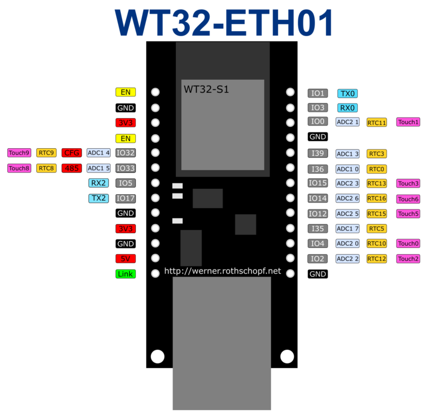

# WT32_KG - Smart Home Controller

## Beschreibung
Ein intelligentes Hausautomatisierungssystem basierend auf dem **WT32-ETH01 (ESP32)** Mikrocontroller. Das System steuert verschiedene Haushaltsgeräte wie Lampen, Rollos und andere elektrische Verbraucher über I²C-Relaismodule und kapazitive Touch-Sensoren.

## Hardware

### Hauptcontroller: WT32-ETH01 (ESP32) – Version 1.4


**Features:**
- Ethernet-Verbindung über LAN8720 PHY
- I²C Kommunikation (GPIO32/SCL, GPIO33/SDA)
- Integrierte WiFi-Funktionalität
- 240MHz Dual-Core Prozessor

### Relais Boards: XL9535-K1V5
8 Kanal Erweiterungsrelais Modul 5V Netzteil I²C Kommunikation Optokoppler Isolation Board

here is a very good documentations about this type of boards:
https://github.com/mcauser/micropython-xl9535-kxv5-relay


#### Verkabelung: 3x PCA9535 Relais Boards (Daisy Chain)

**I²C-Adressen:**
- Board A: `0x22` (A1 gelötet, A0+A2 offen)
- Board B: `0x23` (A1+A0 gelötet, A2 offen)  
- Board C: `0x24` (A2 gelötet, A0+A1 offen)

**Komplettes Anschlussdiagramm WT32-ETH01 System:**

```
╔══════════════════════════════════════════════════════════════════════════════════════════════════════════════════╗
║                                    WT32-ETH01 (ESP32) Smart Home Controller                                      ║
║                                              Version 1.4                                                         ║
╚══════════════════════════════════════════════════════════════════════════════════════════════════════════════════╝

                                           ┌─────────────────────────────────────┐
                                           │          WT32-ETH01 (ESP32)         │
                                           │                                     │
                                           │  GPIO32/SCL ──┬─ [4.7kΩ] ── 3.3V    │
                                           │  GPIO33/SDA ──┼─ [4.7kΩ] ── 3.3V    │
                                           │  GPIO12 ──────┼─ 1-Wire Temp        │
                                           │  GPIO14 ──────┼─ LED Dimmer PWM     │
                                           │  GPIO17 ──────┼─ Status LED         │
                                           │  GND ─────────┼─ Common Ground      │
                                           │  3.3V ────────┼─ Logic Power        │
                                           └───────────────┼─────────────────────┘
                                                           │
                ┌──────────────────────────────────────────┼───────────────────────────────┐
                │                                    │                                     │
                │           I²C BUS                  │                                     │
                │      (SCL/SDA/GND)                 │                                     │
                │                                    │                                     │
      ┌─────────┼─────────┐                ┌─────────┼─────────┐                 ┌─────────┼─────────┐
      │         │         │                │         │         │                 │         │         │
      │         │         │                │         │         │                 │         │         │

┏━━━━━━━━━━━━━━━━━━━━━━━━━━━━━━━━━┓  ┏━━━━━━━━━━━━━━━━━━━━━━━━━━━━━━━━━┓  ┏━━━━━━━━━━━━━━━━━━━━━━━━━━━━━━━━━┓
┃        PCF8574 INPUT            ┃  ┃         PCA9535 RELAIS          ┃  ┃        MPR121 TOUCH             ┃
┃                                 ┃  ┃                                 ┃  ┃                                 ┃
┃  Board 1 (0x20)                 ┃  ┃  Board A (0x22) → R00-R07       ┃  ┃  Panel 1 (0x5A)                 ┃
┃  ├─ P0: IR-Switch Links         ┃  ┃  ├─ P0-P7: 8x Relais Ausgänge   ┃  ┃  ├─ Tür Garten EG               ┃
┃  ├─ P1: IR-Switch Rechts        ┃  ┃  └─ 5V Extern (100mA)           ┃  ┃  └─ 12x Touch Elektroden        ┃
┃  ├─ P2-P6: Kreuzschaltungen     ┃  ┃                                 ┃  ┃                                 ┃
┃  └─ P7: Reserve                 ┃  ┃  Board B (0x23) → R08-R15       ┃  ┃  Panel 2 (0x5C)                 ┃
┃                                 ┃  ┃  ├─ P0-P7: 8x Relais Ausgänge   ┃  ┃  ├─ Säule Garten EG             ┃
┃  Board 2 (0x21)                 ┃  ┃  └─ 5V Extern (100mA)           ┃  ┃  └─ 12x Touch Elektroden        ┃
┃  └─ P0-P7: Reserve Eingänge     ┃  ┃                                 ┃  ┃                                 ┃
┃                                 ┃  ┃  Board C (0x24) → R16-R23       ┃  ┃  Panel 3 (0x5D)                 ┃
┗━━━━━━━━━━━━━━━━━━━━━━━━━━━━━━━━━┛  ┃  ├─ P0-P7: 8x Relais Ausgänge   ┃  ┃  ├─ Säule Straße EG             ┃
                                     ┃  └─ 5V Extern (100mA)           ┃  ┃  └─ 12x Touch Elektroden        ┃
          ┌─ Kabel EG11              ┗━━━━━━━━━━━━━━━━━━━━━━━━━━━━━━━━━┛  ┗━━━━━━━━━━━━━━━━━━━━━━━━━━━━━━━━━┛
          ├─ Kabel EG10                        │                              │
          ├─ Kabel EG1                         │                              │
          ├─ Kabel KG1                  ┌─────────────┐              ┌──────────────────┐
          └─ weitere Schalter           │ 230V Relais │              │ Touch Elektroden │
                                        │ Verbraucher │              │ kapazitive Pads  │
                                        └─────────────┘              └──────────────────┘

┌───────────────────────────────────────────────────────────────────────────────────────────────────────────────────┐
│                                           ZUSÄTZLICHE KOMPONENTEN                                                 │
├───────────────────────────────────────────────────────────────────────────────────────────────────────────────────┤
│                                                                                                                   │
│  GPIO12 ──┬─ DS18B20 Sensor 1 (Raum)         ║  GPIO14 ── MOSFET ── LED Kellertreppe                              │
│           ├─ DS18B20 Sensor 2 (Boden 1)      ║                                                                    │
│           ├─ DS18B20 Sensor 3 (Boden 2)      ║  GPIO17 ── Status LED (OnBoard)                                    │
│           ├─ DS18B20 Sensor 4 (Vorlauf)      ║                                                                    │
│           └─ DS18B20 Sensor 5 (Rücklauf)     ║  ETH ──── LAN8720 PHY ── RJ45 Netzwerk                             │
│                                              ║                                                                    │
└───────────────────────────────────────────────────────────────────────────────────────────────────────────────────┘
```

**I²C-Adressbelegung:**
```
┌─────────────┬─────────┬──────────────────────────────────────┐
│   Adresse   │  Typ    │              Beschreibung            │
├─────────────┼─────────┼──────────────────────────────────────┤
│    0x20     │ PCF8574 │ Input Board 1 (Schalter/Taster)      │
│    0x21     │ PCF8574 │ Input Board 2 (Reserve Eingänge)     │
│    0x22     │ PCA9535 │ Relais Board A (R00-R07)             │
│    0x23     │ PCA9535 │ Relais Board B (R08-R15)             │
│    0x24     │ PCA9535 │ Relais Board C (R16-R23)             │
│    0x5A     │ MPR121  │ TouchPanel 1 (Tür Garten EG)         │
│    0x5C     │ MPR121  │ TouchPanel 2 (Säule Garten EG)       │
│    0x5D     │ MPR121  │ TouchPanel 3 (Säule Straße EG)       │
└─────────────┴─────────┴──────────────────────────────────────┘
```

**WT32-ETH01 Pinbelegung:**
```
┌─────────┬─────────────┬────────────────────────────────────────┐
│   Pin   │  Funktion   │               Beschreibung             │
├─────────┼─────────────┼────────────────────────────────────────┤
│ GPIO32  │ I²C SCL     │ Clock für alle I²C Geräte + 4.7kΩ PU   │
│ GPIO33  │ I²C SDA     │ Daten für alle I²C Geräte + 4.7kΩ PU   │
│ GPIO12  │ 1-Wire      │ DS18B20 Temperatursensoren (5x)        │
│ GPIO14  │ PWM         │ LED Dimmer Kellertreppe (MOSFET)       │
│ GPIO17  │ Status LED  │ OnBoard LED (aktiv HIGH)               │
│ GND     │ Masse       │ Gemeinsame Masse für alle Geräte       │
│ 3.3V    │ Logic       │ Pullup-Versorgung, kein Board-Power    │
│ ETH     │ Netzwerk    │ LAN8720 PHY → RJ45 Ethernet            │
└─────────┴─────────────┴────────────────────────────────────────┘
```

**Wichtige Hinweise:**
- **Separate 5V Versorgung** für jedes PCA9535 Relais Board (je ~100mA) 
- **4.7kΩ Pullup-Widerstände** nur einmal am WT32-ETH01 (SDA/SCL → 3.3V)
- **Gemeinsame Masse** zwischen WT32-ETH01 und allen Boards zwingend erforderlich
- **Kein Pegelwandler** nötig (3.3V Logic kompatibel mit allen Boards)
- **4-poliger I²C Stecker**: Pin1=GND, Pin2=5V, Pin3=SDA, Pin4=SCL
- **TouchPanels** benötigen keine separate Versorgung (3.3V über I²C ausreichend)

**Relais-Nummerierung:**
- Board A (0x22): R00-R07 (Pin 0-7)
- Board B (0x23): R08-R15 (Pin 0-7)
- Board C (0x24): R16-R23 (Pin 0-7)

### Touch Interface
Kapazitive Touch-Sensoren für intuitive Bedienung


## System-Funktionen

### 🏠 Beleuchtungssteuerung
- **[Außenlampe Garten](src/main.cpp#L298)** - Gartenbeleuchtung (R04)
- **[Steinlampe](src/main.cpp#L305)** - Dekorative Beleuchtung (R05)
- **[KG Flurlampe](src/main.cpp#L312)** - Kellergeschoss Flurbeleuchtung (R06)
- **[Küchenarbeitslampe](src/main.cpp#L319)** - Arbeitsplatzbeleuchtung Küche (R07)
- **[Küchenlampe](src/main.cpp#L326)** - Hauptbeleuchtung Küche (R08)
- **[EG Flurlampe](src/main.cpp#L333)** - Erdgeschoss Flurbeleuchtung (R09)
- **[Trägerlampen](src/main.cpp#L340)** - Strukturbeleuchtung (R10)
- **[Wohnzimmerlampe 1](src/main.cpp#L347) & [2](src/main.cpp#L354)** - Wohnzimmerbeleuchtung (R11, R12)

### 🎚️ Rollladensteuerung
- **[Fensterrollo hoch](src/main.cpp#L261) / [runter](src/main.cpp#L270)** - Automatische Auf/Ab-Steuerung mit Zeitbegrenzung (60s)
- **[Türrollo hoch](src/main.cpp#L279) / [runter](src/main.cpp#L288)** - Automatische Auf/Ab-Steuerung mit Zeitbegrenzung (60s)

### 🌐 Web-Interface
- **[HTTP Webserver](src/main.cpp#L174)** auf Port 80
- **[Echtzeit-Steuerung](src/main.cpp#L217)** aller Relais über Browser
- **[Status-Anzeige](src/main.cpp#L224)** aller Ein-/Ausgänge
- **[Toggle-Funktion](src/main.cpp#L241)** per Klick

### 👆 Touch-Bedienung
- **[3x MPR121 Sensoren](src/main.cpp#L62)** für kapazitive Touch-Eingabe
- **[TouchBoard 1](src/main.cpp#L398)**: Tür Garten EG - Fenster-/Türrollo, Wohnzimmer, Gartenlampe
- **[TouchBoard 2](src/main.cpp#L410)**: Säule Garten EG - Küchen-/Trägerlampen, Gruppensteuerung
- **[TouchBoard 3](src/main.cpp#L422)**: Säule Straße EG - Duplikat der Säule Garten
- **[Touch-Handler Funktion](src/main.cpp#L387)**: Zentrale Touch-Verarbeitung

### ⚡ Hardware-Interface
- **[3x PCA9535](src/main.cpp#L57)** I²C GPIO-Expander für 24 Relais-Ausgänge
- **[2x PCF8574](src/main.cpp#L52)** I²C GPIO-Expander für 16 digitale Eingänge
- **[I²C Bus](src/main.cpp#L47)** auf GPIO32 (SCL) und GPIO33 (SDA)

### 🔧 Technische Features
- **[Ethernet-Kommunikation](src/main.cpp#L132)** für stabile Netzwerkverbindung
- **[Interrupt-basierte](src/main.cpp#L193)** Touch-Erkennung
- **[Zeitgesteuerte Relais](src/main.cpp#L199)** für Rollläden mit automatischer Abschaltung
- **[Gruppensteuerung](src/main.cpp#L374)** mehrerer Lampen gleichzeitig
- **[Fail-Safe Initialisierung](src/main.cpp#L155)** aller Relais im AUS-Zustand

## Webserver-Bedienung
Das System bietet eine intuitive Web-Oberfläche zur Steuerung aller angeschlossenen Geräte:

**Zugriff:** `http://[IP-Adresse-des-WT32]/`

**Funktionen:**
- **[Einzelsteuerung](src/main.cpp#L241)** aller 24 Relais
- **[Live-Status-Anzeige](src/main.cpp#L224)** (EIN/AUS)
- **[Eingangsstatus](src/main.cpp#L232)** der 16 digitalen Eingänge
- **[Toggle-Funktion](src/main.cpp#L241)** per Klick

### 📋 Relais-Zuordnung
- **[Relaisnamen Array](src/main.cpp#L70)** - Übersicht aller 24 Relais mit Beschreibung

---

**Referenz WebGUI Design:**  
https://werner.rothschopf.net/microcontroller/202401_esp32_wt32_eth01_en.htm


## Flashen

Manuelles Flashen
🔌 **Verkabelung**

| WT32-ETH01 | CP2102 | Beschreibung |
|------------|--------|--------------|
| 3V3        | 3.3V   | Stromversorgung |
| GND        | GND    | Masse |
| TX0        | RXD    | Daten zum PC |
| RX0        | TXD    | Daten vom PC |
| EN         | DTS    | als Reset genutzt (muss man an der Seite anlöten / siehe Bild) |
| IO0        | GND    | (nur während Flashen) Bootmodus aktivieren |

Ablauf manuell:
1. IO0 mit GND verbinden → Bootmodus aktiv

2. EN kurz auf GND tippen → Reset auslösen

3. Flash starten (z. B. mit esptool oder ESPHome-Flasher)

4. Nach dem Flashen: IO0 wieder trennen, Power Cycle für Neustart


